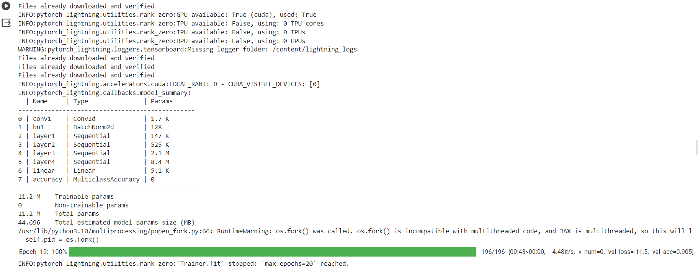
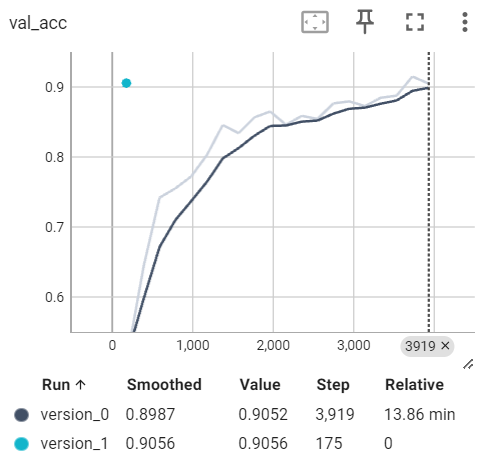

# Assignment 13

# Problem Statement
To train a resnet18 model in pytorch lightning.

# File Structure

repo contains all the code required during training in different modules
   - S13.ipynb -> contains the execution of code 
   - resnet_lightning.py -> contains the resnet18 model compatible with pytorch lightning
   - augmentations.py -> contains albumentaions functionalities
   - utils.py -> contains necessary support funtions
   - visualize.py -> support functions for visualizations

# Model observations
 
# Training Logs

    

# Results
Output graphs in tensorboard

    

Missclassified images

    

